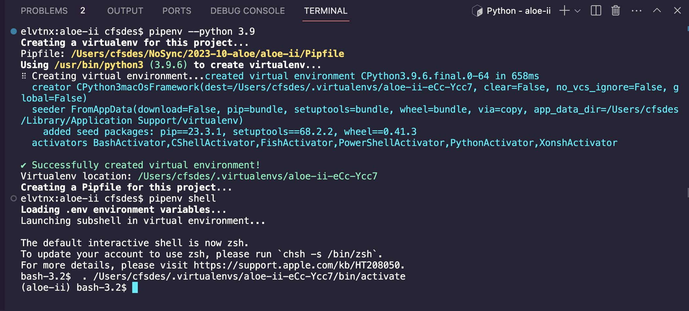
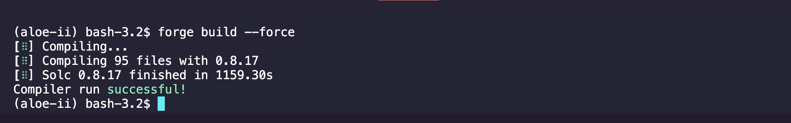
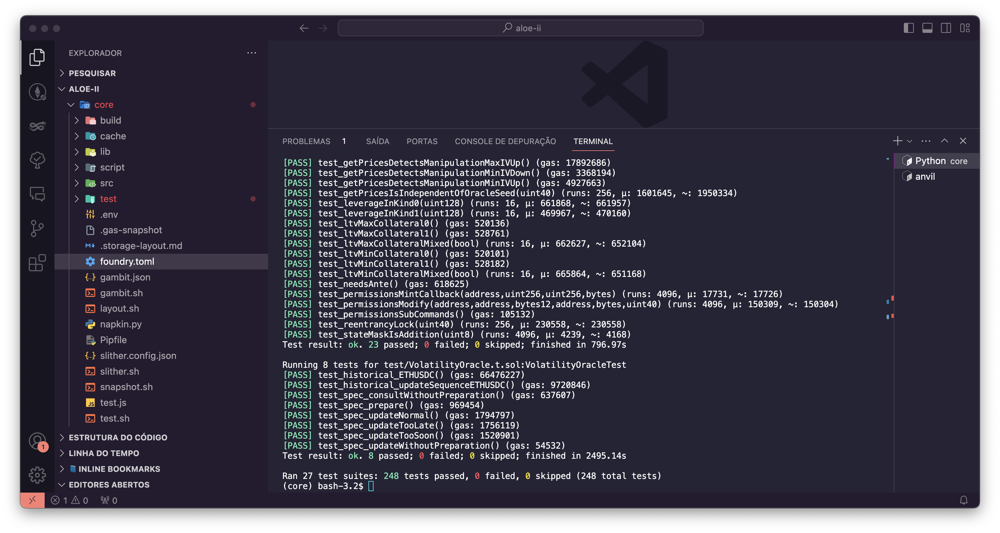
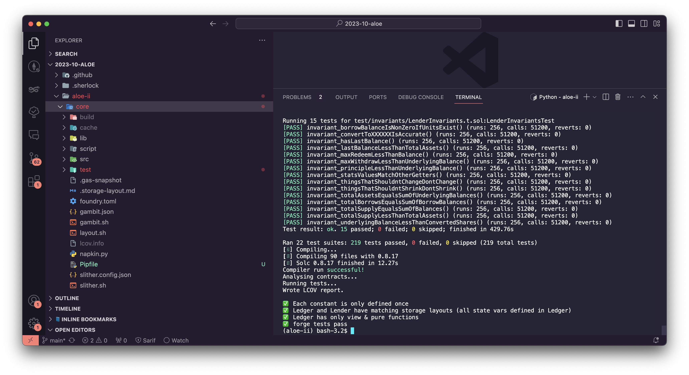
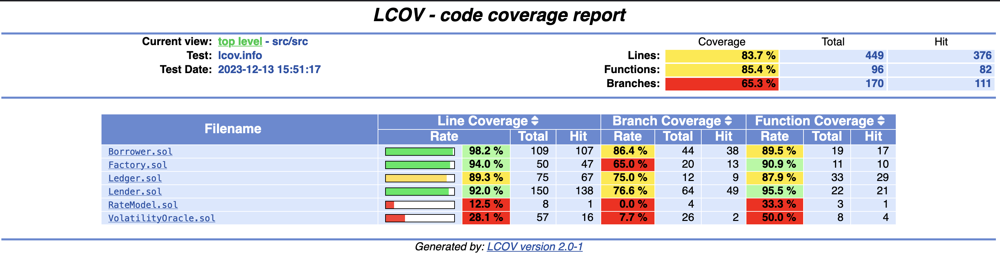
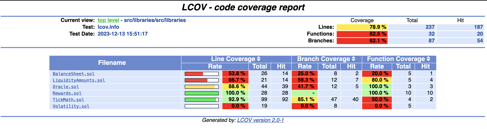

[TOC]


# [Aloe Capital](https://github.com/sherlock-audit/2023-10-aloe)

## Introduction

Aloe II is a money market that lets users earn yield, use Uniswap positions as collateral, or create new ones on margin. 

Aloe II can be used in two different ways:

- **Lending Side (Earn):** It allows users to provide assets to the lending markets in Aloe Prime to earn yields on their assets. These types of investors are called "Passive Investors".
- **Borrow side (Prime):** On the other hand, users with more experience (named "**Marked Makers**") can deploy capital from lending markets into their chosen trading pair, executing LP strategies for profit. 
  - Market makers interact with Aloe Prime through margin accounts, which are special, user-owned contracts that have permission to borrow from the lending markets. These accounts present an interface to their owner, allowing them to control borrow amounts and Uniswap V3 position creation. When positions are closed, earned fees are collected in margin balances, which can ultimately be withdrawn by the market makers.

## How it works

1. "Passive Investors" deposit tokens to create isolated lending market on Uniswap V3 pairs

   

2. To market-make on margin, "Market makers" open a margin account and deposit margin made up of the assets in the pool.

   > The total value is what matters, not the specific composition. If they wish, they may only provide margin in one asset.

   

3. Next, Market Makers open a leveraged Uniswap V3 concentrated liquidity position through the Aloe Margin account.

   

4. When they want to close the position and repay the loan, the divergence loss *(also known as IL, or the difference in value between the Uniswap V3 position and the outstanding liabilities)* is deducted from the margin account, along with the interest paid to lenders. They keep the earned trading fees and remaining margin.

   

5. If they fail to close the position in time, or the position accrues too much of a loss, they can get liquidated.

   1. The liquidation threshold is determined by the amount of margin for a given position *(aka leverage factor)*, the position bounds, and the volatility of the underlying assets.
   2. If the IL suffered by their position gets too close to the value of their margin, anyone can liquidate their margin account and close the borrows.
   3. Much like a regular borrow, closing the position will deduct IL from the market makers' margin account. Additionally, a small incentive will be paid to the liquidator responsible for repaying the borrows.


Below is a summary of the Market Maker workflow:

 


## Contracts

```
Borrower -- "Allows its owner to create and manage leveraged Uniswap positions"
Factory -- "Deploys new lending pairs"
Ledger -- "Contains storage and view methods for Lender"
Lender -- "Allows users to deposit and earn yield (ERC4626)"
RateModel -- "Computes interest rates from utilization"
VolatilityOracle -- "Estimates implied volatility for any Uniswap V3 pair"

libraries
|-- constants
    |-- Constants -- "Defines important protocol parameters"
    |-- Q -- "Defines Q numbers"
|-- BalanceSheet -- "Provides functions for computing a Borrower's health"
|-- Exp -- "Exponential function (e^x)"
|-- LiquidityAmounts -- "Translates liquidity to amounts or vice versa"
|-- Log2 -- "Logarithm and exponentiation in base 2"
|-- MulDiv -- "Multiply and divide with 512 bit precision"
|-- Oracle -- "Provides functions to integrate with Uniswap V3 oracle"
|-- Positions -- "Packs Uniswap positions into Borrower's storage efficiently"
|-- Rewards -- "Implements logic for staking rewards"
|-- TickMath -- "Translates ticks to prices or vice versa"
|-- Volatility -- "Computes implied volatility from observed swap fee earnings"
```

> The `Lender` is [ERC4626](https://docs.aloe.capital/aloe-ii/mechanisms/erc4626) compliant, with two exceptions: various view methods may revert upon reentrancy, and `redeem` treats `type(uint256).max` as a special case. Also, `deposit` and `redeem` are much more gas efficient than `mint` and `withdraw`.


## References

- [Repository](https://github.com/sherlock-audit/2023-10-aloe)
- [Documentation](https://docs.aloe.capital/)
- [Contracts Documentation](https://aloelabs.github.io/aloe-ii/index.html)
- [Auditors Quick Start](https://docs.aloe.capital/aloe-ii/auditor-quick-start)


## Previous Audits

- [BlockSec](https://drive.google.com/file/d/1aWEkCTTcuEnupf6nbIsqWy38igsj9-Hx/view)
- [Sherlock](https://github.com/sherlock-audit/2023-10-aloe-judging)
- [Immunefi](https://immunefi.com/bounty/aloeprotocol/)


# Audit Kit

| Language | .sol Files | Lines of Code | SDK     |
| -------- | ---------- | ------------- | ------- |
| Solidity | 18         | 2079          | Foundry |

## Audit Scope

All contracts inside: `aloe-ii/core`


## Initial Set-Up

> Since the main project being audited is located at `aloe-ii/core`, all setup will be performed inside this directory.

### Virtual Environment

There are some contracts that utilize python scripts with the `ffi` foundry cheatcode. Therefore, to avoid any potential errors during compilation, it's recommended to build and run all tests in a virtual python environment. To configure it:

```bash
pipenv --python 3.9
pipenv shell
pip install slither-analyzer
```




### Install Dependencies & Build

To install all required dependencies and build the contracts:

```bash
forge install
forge build
```




## Foundry Tests

### Environment Variables

The project uses RPC URLs to make forks from Ethereum and Optimism mainnet. It gets the RPC URLs from the environment variables to perform the tests. 

The following environment variables must be set:

```bash
export RPC_URL_MAINNET=https://mainnet.infura.io/v3/<API_KEY>
export RPC_URL_OPTIMISM=https://optimism-mainnet.infura.io/v3/<API_KEY>
```

> You can get the RPC URLs from [Infura](https://www.infura.io/), [Alchemy](https://www.alchemy.com/dapps/alchemy) or any other node providers.


### Running Tests (manually)

As mentioned before, there are some tests that use the `ffi` cheatcode. Hence, to execute the tests without any error, it's required to provide the `--ffi` argument.

```
forge test --ffi
```

> If you suffer any problems related to the `anvil` environment, execute the `anvil` manually in another terminal before running the tests. 
>
> This is recommended because the `Borrower.t.sol` contract runs the `anvil` command using the `ffi` cheatcode, which can sometimes return errors.




### Running Tests (script)

**Aloe** project has a ready-to-use `test.sh` script. The script is located at `aloe-ii/core/test.sh` and it runs the unit tests + code coverage automatically. To use it:

```bash
cd ./aloe-ii/core && ./test.sh
```



The test coverage result (`lcov.info`) will be stored in the `core/` directory. Next, use `genhtml` to generate the html results for it:

```bash
genhtml lcov.info --branch-coverage --output-dir coverage --ignore-errors category
```

> The `--ignore-errors` was required to avoid return errors for some statements structures used in the contracts.

It's highly recommended to use the script to generate the coverage report, because the project has contracts that can cause **stack-too-deep** when coverage instrumentation is added.


## Coverage Results

### /src



### /libraries




# Static Analyzer Results

## Main False Positives Excluded

### slither: call-loops

| Issue                                                        | Reason                                                       |
| ------------------------------------------------------------ | ------------------------------------------------------------ |
| Factory.claimRewards(Lender[],address) has external calls inside a loop: earned += lenders[i].claimRewards(msg.sender) | The array of lenders used in the loop to claim rewards is controllable by the caller. Therefore, it cannot lead to denial of service. |


### slither: dead-code

| Issue                                                        | Reason                                    |
| ------------------------------------------------------------ | ----------------------------------------- |
| [zip(int246\]) is never used and should be removed           | The function is being used by unit tests. |
| log2(uint256,uint8) is never used and should be removed      | The function is being used by unit tests. |
| TickMath.ceil(int24,int24) is never used and should be removed | The function is being used by unit tests. |


### slither: arbitrary-send-eth

| Issue                                                        | Reason                                                       |
| ------------------------------------------------------------ | ------------------------------------------------------------ |
| Borrower.liquidate(ILiquidator,bytes,uint256,uint40) sends eth to arbitrary user<br/>Dangerous calls:<br/>- address(callee).transfer(address(this).balance / strain) | It's expected by design. The liquidate function can be used to liquidate [unhealthy borrowers](https://docs.aloe.capital/aloe-ii/mathematics/health). |


### slither: low-level-calls

| Issue                                                        | Reason                                                       |
| ------------------------------------------------------------ | ------------------------------------------------------------ |
| Low level call in Factory._newBorrower(IUniswapV3Pool,Lender,Lender):<br />- (success,data) = address(_BORROWER_DEPLOYER).delegatecall(abi.encodeCall(BorrowerDeployer.deploy,(ORACLE,pool,lender0,lender1))) | The low level call is being made to the borrower deployer contract, which is a hardcoded contract address used to deploy new borrowers. Therefore, there is no risk of a transfer for a non-existent contract or calldata manipulation. |


### slither: incorrect-shift

| Issue                                                        | Reason                                                       |
| ------------------------------------------------------------ | ------------------------------------------------------------ |
| TickMath.getSqrtRatioAtTick(int24) contains an incorrect shift operation: ratio = 0xfffcb933bd6fad37aa2d162d1a59400100000000000000000000000000000000 >> absTick & 0x1 << 7 & 0x1ffffffffffffffffffffffffffffffff | There is an already fuzz test case for tick (`test_comparitive_getSqrtRatioAtTick`) to check if a random tick can lead to shift problems. Also, the tick value cannot be manipulated by external actors. |


### slither: reentrancy

| Issue                                                        | Reason                                                       |
| ------------------------------------------------------------ | ------------------------------------------------------------ |
| Reentrancy in Lender.flash(uint256,IFlashBorrower,bytes):<br/>External calls:<br/>- to.onFlashLoan(msg.sender,amount,data)<br/>State variables written after the call(s):<br/>- lastAccrualTime = lastAccrualTime_<br/>Ledger.lastAccrualTime can be used in cross function reentrancies:<br/>- Ledger._getCache()<br/>- Lender._load()<br/>- Lender._save(Ledger.Cache,bool)<br/>- Lender.flash(uint256,IFlashBorrower,bytes)<br/>- Lender.initialize()<br/>- Ledger.lastAccrualTime | The function uses the lastAccrualTime variable to protect against reentrancy attacks. Lines: 297-299. |
| Reentrancy in Borrower.modify(IManager,bytes,uint40):        | It doesn't perform any sensitive operation before the externall call. Also, the modify function is restricted to owner only. |

### slither: missing-zero-check

| Issue                                                        | Reason                                                       |
| ------------------------------------------------------------ | ------------------------------------------------------------ |
| Borrower.withdrawAnte(address).recipient lacks a zero-check on :<br/>- recipient.transfer(address(this).balance) | The `transfer` function reverts if the receipient is invalid. Therefore, a zero check in this case is not required. |


## Valid Findings

### slither: dead-code

#### Summary

There are some occurrences of unused (`dead`) code in some contracts.

#### Vulnerability Details

Avoiding to have unused code in the contracts is a good practice since it helps to keep the code clean and readable.

In `Log2.sol`, the `log2Up(uint256 x, uint8 iters)` function exists but it is not being used in the contracts nor for tests, so it could be removed.

#### Proof of Concept

Affected lines:

- https://github.com/sherlock-audit/2023-10-aloe/blob/main/aloe-ii/core/src/libraries/Log2.sol#L225-L230

#### Recommended Mitigation Steps

Remove the unused code.


### slither: missing-zero-check

#### Vulnerability Details

Some parameters of functions are not checked for invalid values:

- `Factory.constructor`: The addresses of `governor` and `reserve` should be checked for non-zero values

#### Proof of Concept

Affected lines:

- https://github.com/sherlock-audit/2023-10-aloe/blob/main/aloe-ii/core/src/Factory.sol#L146C3-L148

#### Impact

A wrong user input or wallets defaulting to the zero addresses for a  missing input can lead to the contract needing to redeploy or wasted gas.

#### Recommended Mitigation Steps

Check that the address is not zero.
